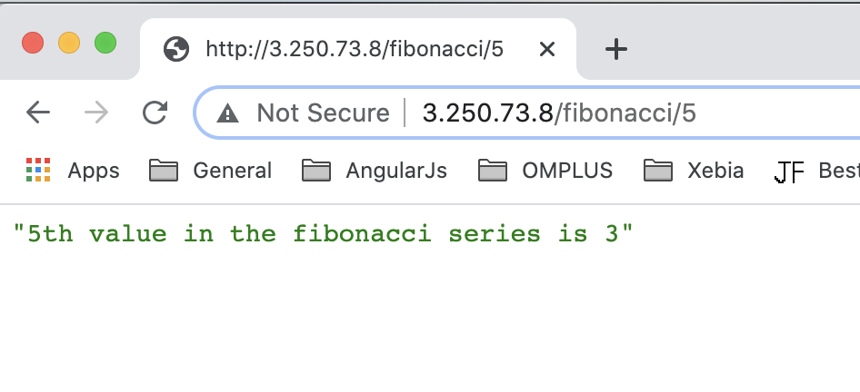
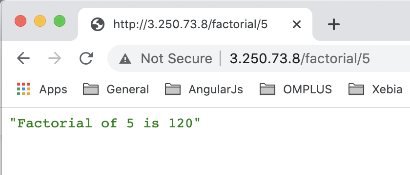
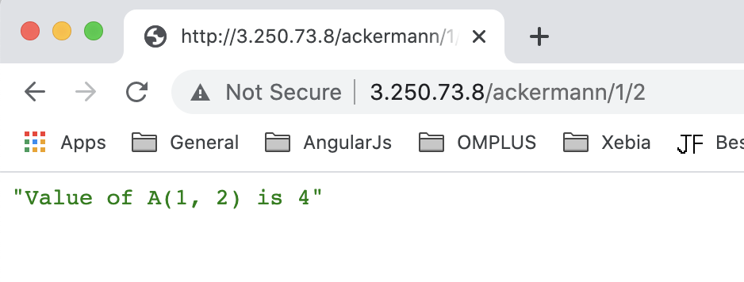

# Overview 
This application can be easily deployed on the AWS cloud since I have already set up the gunicorn server as well. 

The main steps to follow for deployment in AWS are as below and will explain each step later on.
* Create an Ubuntu EC2 instance on AWS
* Copy and Setup project in created EC2 instance.
* Run Gunicorn to serve our Mathematical web service application.
* Create a unit file to manage the Gunicorn server.
* Run NGINX as reverse-proxy to serve the requests from user to Gunicorn.

**Step 1. Create an EC2 instance on AWS**

* Create an EC2 instance from AWS console and select Ubuntu AMI image which runs python3 as default i.e., Ubuntu 18.4 AMI.
* Select the instance type for your EC2 instance, here i am using `t2.micro` to be in free tier.
* Click Next until Security Groups don't come.
* Choose `Security Groups` with allowing **HTTP(port 80), SSH(port 22), HTTPS(port 443), CustomTCP(port 5000)** as 
  inbound traffic.
* After next, Create your keypair to connect with your instance.

**Step 2. Copy and SetUp project in EC2 instance**

* Login to your machine using SSH and then install `virtualenv` script and `nginx`.
    ```
    sudo apt-get update 
    sudo apt-get install -y python3-venv nginx
    ```
* Copy the project into specific path like `/home/ubuntu/` for example.
* Create the virtual environment and activate the environment using below command. 
    ```
    python3 -m venv venv
    source venv/bin/activate
    ```
* Install the requirements file using below command.
    ```
    pip install -r requirements.txt
    ```

**Step 3. Run Gunicorn to serve the application**

* Since We already installed the `gunicorn` module in previous step using the `requirements.txt`. 
* Run the application using gunicorn with below command to test if it works as we did in normal run through gunicorn.
    ```
    gunicorn -b 0.0.0.0:5000 wsgi:app
    ```
  You can configure different port number but make sure that is allowed in your instance security group. To use other 
  parameters, please check the gunicorn [docs](https://docs.gunicorn.org/en/latest/settings.html#settings). The basic 
  common is configuring the worker threads and log level.
  
**Step 4. Create unit file to manage Gunicorn**

* Create a `<name>.service` file inside `/etc/systemd/system/` folder and need to let it know on system starts or reboot.
* Add the below contents inside the file.
    ```
    [Unit]
    Description=Gunicorn instance for mathematical web service application
    After=network.target
    
    [Service]
    User=ubuntu
    Group=www-data
    WorkingDirectory=/home/ubuntu/klarna
    ExecStart=/home/ubuntu/klarna/venv/bin/gunicorn -b localhost:5000 wsgi:app
    
    [Install]
    WantedBy=multi-user.target
    ```
  `Unit` - This section defines project description and start this after reaching the networking target.
  
  `Service` - This section defines the user/group under which the process run. Nginx will communicate to gunicorn so 
   need to provide permission to `www-data` group. Also it has the binary executable and the working directory.
  
   `Install` - This section tells at which time this service should start during booting process.

* Reload the service now using below commands.
    ```
    sudo systemctl daemon-reload
    sudo systemctl start klarna
    sudo systemctl enable klarna
    ```
**Step 5. Run Nginx to service gunicorn**

* Start Nginx service since using below commands we already installed `nginx` in step1. 
    ```
    sudo systemctl start nginx
    sudo systemctl enable nginx
    ```
* Edit the default file in the `sites-available` folder and add `proxy_pass` to `http:127.0.0.1:5000` at `location /`. 
This change will look like below code.
  ```
    location / {
        proxy_pass http://127.0.0.1:5000;
    }
  ```
  
* Restart the Nginx service using below command, and then you can see the application at EC2 public IP.
    ```
    sudo systemctl restart nginx
    ```

**NOTE** - You can create a different file rather than changing `default` file and then to enable your file, create a 
symlink of this file to `sites-available` directory. 

The final steps make sure the deployment of the project.

See some samples attached screenshot for example I deployed on my EC2 instance. 







